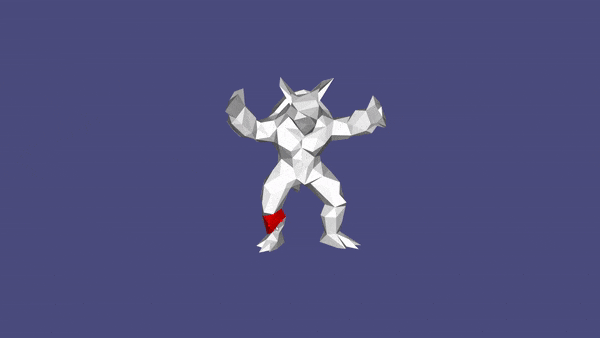

# ARAP Deformer

This implementation offers an interactive mesh deformer for triangulated meshes. It allows the user to directly interact with a mesh in a graphical user interface and to view the deformation in real-time. It is an implementation of the ARAP deformation algorithm by Sorkine et al. [1]. 
The algorithm optimizes the rotations and positions of the vertices by considering their local rigidity, i.e. the local cells consisting of a vertex and its neighbors. This procedure can be done in an iterative flip-flop fashion where the rotations are estimated with the Procrustes algorithm and the new vertex positions with a linear equation system (LES).

For the deformation the user can choose between the following weights:
- Constant: 
- Uniform: , where  is the number of neighbors of vertex i
- Cotangent: 

Sparse matrices are supported and for the estimation of the vertex locations the user can decide on which decomposition is used for solving the LES.

The interactive mesh deformer allows the user to load a triangulated mesh, select static vertices and handles. The deformation is done by dragging the handles in the GUI. The deformer performs well on meshes up to 1000 vertices (without OpenMP). The code is based on libigl, glob, glew and Eigen. OpenMP support is optional.

Contributors: Maximilian Hess, Konstantin Karas, Anna Reithmeir, Moritz Schirra

[1] Olga Sorkine and Marc Alexa. As-rigid-as-possible surface modeling. In: Symposium on Geometry processing, volume 4, pages 109–116, 2007.
